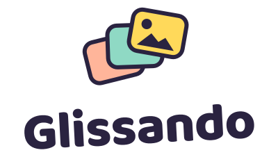

  <picture>
    <source srcset="assets/brand/logo-stacked-dark.svg" media="(prefers-color-scheme: dark)">
    
  </picture>

Glissando turns your photos and a piece of music into a beautiful slideshow — gliding Ken Burns
moves and smooth transitions, chosen for you. It is a web app you install like an app (PWA), made
for offline use: your pictures stay on your device, and no server or internet connection is
needed once it is installed.

**Status:** early development — nothing to use yet. What is planned, and in which order, is in
[`dev-docs/SCOPE.md`](dev-docs/SCOPE.md).

Runs in current Chrome, Edge, Firefox and Safari (including iPhone and iPad), in German and
English.

## License

[MIT](LICENSE). The Baloo 2 font is licensed under the [SIL Open Font License 1.1](assets/fonts/OFL.txt).
